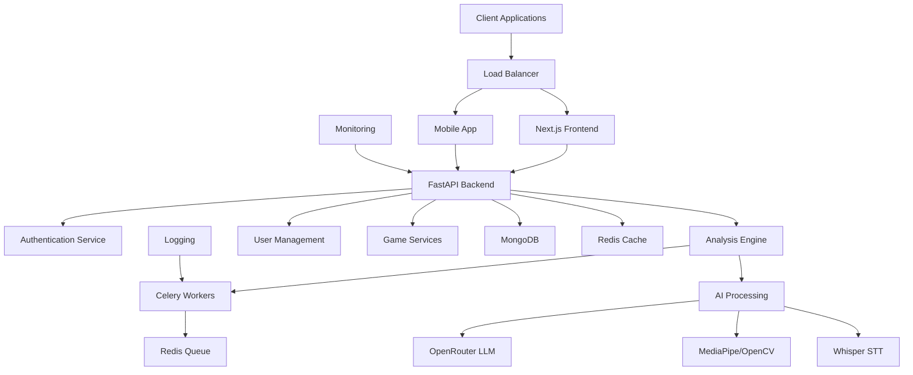

# VAANIX - AI Speech Training Platform

<p align="center">
  
  
  
  
  
  
  
</p>

<p align="center">
  
</p>

<h1 align="center">VAANIX - AI Speech Training Platform</h1>

<p align="center">
  <strong>Level up your speech with VAANIX — AI-powered analysis of voice, expressions, and content.</strong>
  <br>
  <strong>Earn XP, unlock achievements, and master communication.</strong>
</p>

<p align="center">
  <a href="#-features"><strong>Features</strong></a> •
  <a href="#-quick-start"><strong>Quick Start</strong></a> •
  <a href="#-documentation"><strong>Documentation</strong></a> •
  <a href="#-contributing"><strong>Contributing</strong></a> •
  <a href="#-license"><strong>License</strong></a>
</p>

<p align="center">
  <a href="https://your-deployment-url.com">Live Demo</a> •
  <a href="https://your-docs-url.com">Documentation</a> •
  <a href="https://github.com/yourusername/vaanix/issues">Issues</a> •
  <a href="https://github.com/yourusername/vaanix/discussions">Discussions</a>
</p>

## 🎯 Overview

VAANIX is an advanced AI-powered speech training platform designed to transform how people develop their public speaking and communication skills. By combining cutting-edge artificial intelligence with gamified learning principles, VAANIX provides personalized, data-driven feedback that helps users overcome common speaking challenges and build confidence.

Built with a modern tech stack featuring Next.js, FastAPI, and real-time AI analysis, VAANIX offers both live practice sessions and video analysis capabilities. The platform's unique approach combines technical metrics with human-centered coaching insights to deliver actionable feedback that actually improves performance.

### 🎯 Key Value Propositions

- **Data-Driven Feedback**: Get precise, measurable insights instead of generic advice
- **Real-Time Analysis**: Immediate feedback during live practice sessions
- **Comprehensive Metrics**: 5-dimensional scoring covering all aspects of effective communication
- **Gamified Learning**: Engaging progression system that makes improvement fun
- **Personalized Growth**: Track your progress over time with detailed analytics

### 🎯 Target Audience

- **Professionals** seeking to improve presentation skills
- **Students** preparing for speeches and presentations
- **Public speakers** wanting to refine their craft
- **Job seekers** practicing interview skills
- **Anyone** looking to communicate more effectively

## 🚀 Key Features

### 🎯 Practice Modes

| Feature | Description | Technology |
|---------|-------------|------------|
| **Live Practice Session** | Real-time analysis with webcam and microphone integration | WebRTC, Socket.IO |
| **Video Upload Practice** | Detailed analysis of pre-recorded presentations | FFmpeg, Async Processing |
| **Challenge Mode** | Structured speaking exercises with specific goals | Gamification Engine |
| **Studio Mode** | Professional recording environment with advanced metrics | Real-time Analytics |

### 🤖 Real-time Analysis Engine

Our AI engine provides comprehensive feedback through three core analysis modules:

1. **Facial Expression Analysis**
   - Tracks 468 facial landmarks using MediaPipe
   - Detects micro-expressions and emotional states
   - Measures eye contact frequency and engagement
   - Analyzes smile patterns and facial dynamics

2. **Voice Quality Analysis**
   - Speech rate monitoring (words per minute)
   - Pitch variation detection
   - Volume consistency analysis
   - Filler word identification and counting
   - Whisper-based transcription with timestamping

3. **Content Delivery Analysis**
   - Structure evaluation using LLM processing
   - Clarity and persuasion scoring
   - Language precision metrics
   - Content flow and logical progression

### 📊 Feedback & Scoring System

#### Five-Dimensional Scoring (0-100 each)

| Dimension | Metrics | Weight | Focus Area |
|-----------|---------|--------|------------|
| **Content Clarity** | Structure, logic, coherence | 25% | Information delivery |
| **Delivery Fluency** | Pace, rhythm, filler words | 20% | Speaking mechanics |
| **Body Language** | Gestures, posture, movement | 20% | Non-verbal communication |
| **Engagement Level** | Eye contact, audience connection | 20% | Connection quality |
| **Language Precision** | Word choice, grammar, vocabulary | 15% | Verbal sophistication |

### 🎮 Gamified Progression System

#### Experience Points (XP) Structure
- **Base XP**: 500 points per completed session
- **Performance Bonuses**: Up to +300 XP for high scores
- **Streak Multipliers**: 1.2x to 2.0x for consecutive days
- **Achievement Rewards**: 100-1000 XP for milestones
- **Challenge Completion**: 200-500 XP per challenge

#### Speaker Levels

| Level | XP Range | Title | Benefits |
|-------|----------|-------|----------|
| 1 | 0-1,000 | **Novice Speaker** | Basic feedback, core features |
| 2 | 1,001-2,500 | **Apprentice** | Advanced metrics, challenge access |
| 3 | 2,501-5,000 | **Competent Communicator** | Detailed analytics, comparison tools |
| 4 | 5,001-10,000 | **Proficient Speaker** | Premium features, priority processing |
| 5 | 10,001-20,000 | **Expert Presenter** | Custom coaching, advanced insights |
| 6 | 20,001-50,000 | **Master Communicator** | Elite features, community recognition |
| 7 | 50,001+ | **Grandmaster** | VIP support, beta feature access |

#### Achievement System

| Achievement | Criteria | Reward | Badge |
|-------------|----------|--------|-------|
| **First Steps** | Complete first analysis | 100 XP | 🥇 |
| **Perfect Score** | 100 in any category | 500 XP | 🏆 |
| **Streak Master** | 7-day practice streak | 300 XP | 🔥 |
| **Content Creator** | Upload 10 videos | 250 XP | 🎬 |
| **Social Butterfly** | Engage with 50 community posts | 200 XP | 🦋 |
| **Consistency King** | 30 consecutive days | 1000 XP | 👑 |
| **Perfectionist** | 90+ in all categories | 750 XP | ✨ |

### 👤 User Management

- **Secure Authentication**: JWT-based authentication with refresh tokens
- **Profile Management**: Customizable profiles with progress tracking
- **Practice History**: Comprehensive session history with performance trends
- **Social Features**: Leaderboards, community engagement, and peer feedback
- **Privacy Controls**: Granular privacy settings for all content

## 🏗️ System Architecture

### High-Level Architecture



### Component Architecture

#### Frontend Layer
```
frontend-next/
├── src/
│   ├── app/                 # Next.js 13 App Router
│   │   ├── (auth)/         # Authentication pages
│   │   ├── (dashboard)/    # Main application
│   │   ├── practice/       # Practice interface
│   │   ├── studio/         # Recording studio
│   │   └── challenges/     # Challenge system
│   ├── components/         # Reusable UI components
│   ├── hooks/             # Custom React hooks
│   └── lib/               # Utility functions
└── public/                # Static assets
```

#### Backend Layer
```
backend/
├── app/
│   ├── api/               # REST API endpoints
│   │   ├── auth.py       # Authentication routes
│   │   ├── practice.py   # Practice functionality
│   │   ├── challenges.py # Challenge system
│   │   └── user.py       # User management
│   ├── agents/           # AI analysis agents
│   │   ├── coordinator_agent.py
│   │   ├── voice_analysis_agent.py
│   │   └── facial_expression_agent.py
│   ├── core/             # Core business logic
│   │   ├── config.py
│   │   ├── scoring_system.py
│   │   └── gemini_coach_engine.py
│   ├── db/               # Database models and connections
│   └── worker.py         # Celery worker configuration
├── temp_uploads/         # Temporary file storage
└── main.py              # Application entry point
```

### Data Flow

1. **User Interaction**: Client sends request via REST API or WebSocket
2. **Authentication**: JWT validation and user context creation
3. **Task Queue**: Long-running analysis tasks queued in Redis
4. **Processing**: Celery workers execute AI analysis pipelines
5. **Data Storage**: Results stored in MongoDB with caching in Redis
6. **Response**: Results delivered to client with real-time updates

### Scalability Considerations

- **Horizontal Scaling**: Multiple backend instances behind load balancer
- **Database Sharding**: MongoDB sharding for large datasets
- **Caching Strategy**: Redis caching for frequently accessed data
- **CDN Integration**: Static asset delivery optimization
- **Microservices Ready**: Modular architecture supports service decomposition

## 🛠️ Technology Stack

### Frontend Technologies

| Technology | Version | Purpose | Key Features |
|------------|---------|---------|--------------|
| **Next.js** | 13.x | React Framework | App Router, SSR, ISR |
| **React** | 18.x | UI Library | Hooks, Context, Concurrent Mode |
| **TypeScript** | 5.x | Type Safety | Static typing, better DX |
| **Tailwind CSS** | 3.x | Styling | Utility-first, responsive |
| **Framer Motion** | 10.x | Animations | Declarative, performance |
| **Shadcn/ui** | Latest | UI Components | Accessible, customizable |
| **Socket.IO** | 4.x | Real-time | WebSockets, fallbacks |
| **Zustand** | 4.x | State Management | Lightweight, easy API |

### Backend Technologies

| Technology | Version | Purpose | Key Features |
|------------|---------|---------|--------------|
| **Python** | 3.9+ | Core Language | Async support, rich ecosystem |
| **FastAPI** | 0.100+ | Web Framework | ASGI, automatic docs, validation |
| **Pydantic** | 2.x | Data Validation | Type hints, serialization |
| **Celery** | 5.x | Task Queue | Distributed, async processing |
| **Redis** | 7.x | Cache/Queue | In-memory, pub/sub, persistence |
| **MongoDB** | 7.x | Database | Document store, aggregation |
| **JWT** | PyJWT | Authentication | Token-based, secure |

### AI/ML Technologies

| Technology | Version | Purpose | Key Features |
|------------|---------|---------|--------------|
| **OpenRouter** | API | LLM Service | Multiple model support |
| **MediaPipe** | Latest | Computer Vision | Face mesh, pose detection |
| **OpenCV** | 4.x | Image Processing | Real-time, cross-platform |
| **Whisper** | Large | Speech Recognition | Multilingual, accurate |
| **FFmpeg** | 6.x | Media Processing | Encoding, filtering, streaming |

### Development & DevOps

| Technology | Purpose | Configuration |
|------------|---------|---------------|
| **Docker** | Containerization | Multi-stage builds |
| **Docker Compose** | Orchestration | Local development |
| **GitHub Actions** | CI/CD | Automated testing |
| **ESLint** | Linting | Code quality |
| **Prettier** | Formatting | Code consistency |
| **Jest** | Testing | Unit/integration tests |
| **Playwright** | E2E Testing | Browser automation |

### Infrastructure

| Service | Purpose | Provider |
|---------|---------|----------|
| **Vercel** | Frontend Hosting | Next.js optimized |
| **Render/Railway** | Backend Hosting | Python support |
| **MongoDB Atlas** | Database | Managed MongoDB |
| **Upstash** | Redis | Serverless Redis |
| **Cloudflare** | CDN | Global edge network |

## 📋 System Requirements

### Minimum Requirements

| Component | Requirement | Notes |
|-----------|-------------|-------|
| **Operating System** | macOS 12+, Windows 10+, Linux | Latest updates recommended |
| **RAM** | 8GB | 16GB recommended for development |
| **Storage** | 10GB free space | For dependencies and media files |
| **CPU** | 4 cores | Intel i5/AMD Ryzen 5 or equivalent |

### Development Environment

| Tool | Version | Installation |
|------|---------|-------------|
| **Python** | 3.9+ | [python.org](https://www.python.org/downloads/) |
| **Node.js** | 18+ | [nodejs.org](https://nodejs.org/) |
| **npm** | 9+ | Included with Node.js |
| **Git** | 2.30+ | [git-scm.com](https://git-scm.com/) |
| **Redis** | 7.0+ | [redis.io](https://redis.io/download/) |
| **MongoDB** | 6.0+ | [mongodb.com](https://www.mongodb.com/try/download) |
| **FFmpeg** | 6.0+ | [ffmpeg.org](https://ffmpeg.org/download.html) |

### Optional Tools

| Tool | Purpose | Recommendation |
|------|---------|---------------|
| **Docker** | Containerization | For consistent environments |
| **Docker Compose** | Service orchestration | For local development |
| **Postman** | API testing | For endpoint validation |
| **MongoDB Compass** | Database GUI | For data exploration |
| **RedisInsight** | Redis GUI | For cache monitoring |

## 🚀 Quick Start Guide

### 📥 Installation

#### 1. Clone the Repository

```bash
# Clone the main repository
git clone https://github.com/yourusername/vaanix.git
cd vaanix

# Optional: Switch to development branch
git checkout develop
```

#### 2. Environment Setup

Create the necessary environment files:

**backend/.env**
```env
# Database Configuration
MONGODB_URL=mongodb://localhost:27017/speech_trainer
MONGODB_DB_NAME=speech_trainer

# Redis Configuration
REDIS_URL=redis://localhost:6379/0

# Authentication
JWT_SECRET_KEY=your-super-secret-jwt-key-here
JWT_ALGORITHM=HS256
JWT_ACCESS_TOKEN_EXPIRE_MINUTES=30

# AI Services
OPENROUTER_API_KEY=your-openrouter-api-key
OPENROUTER_BASE_URL=https://openrouter.ai/api/v1
OPENROUTER_MODEL=openrouter/auto

# File Upload
MAX_CONTENT_LENGTH=104857600
UPLOAD_FOLDER=temp_uploads

# Application
DEBUG=True
LOG_LEVEL=INFO
```

**frontend-next/.env.local**
```env
# API Configuration
NEXT_PUBLIC_API_URL=http://localhost:8000
NEXT_PUBLIC_WS_URL=ws://localhost:8000

# Application
NEXT_PUBLIC_APP_NAME=VAANIX
NEXT_PUBLIC_APP_VERSION=2.0.0

# Feature Flags
NEXT_PUBLIC_ENABLE_ANALYTICS=false
NEXT_PUBLIC_ENABLE_GA=false
```

#### 3. Backend Setup

```bash
# Navigate to backend directory
cd backend

# Create virtual environment
python -m venv venv

# Activate virtual environment
# On macOS/Linux:
source venv/bin/activate
# On Windows:
venv\Scripts\activate

# Install dependencies
pip install -r requirements.txt

# Initialize database (if needed)
python -m app.db.seed_challenges
python -m app.db.seed_leaderboard
```

#### 4. Frontend Setup

```bash
# Navigate to frontend directory
cd ../frontend-next

# Install dependencies
npm install

# Install additional dev dependencies
npm install -D @types/node @types/react @types/react-dom
```

### ▶️ Running the Application

#### Method 1: Manual Startup (Recommended for Development)

**Terminal 1 - Redis Server:**
```bash
redis-server
```

**Terminal 2 - Celery Worker:**
```bash
cd backend
celery -A app.worker.celery_app worker --loglevel=info --pool=solo
```

**Terminal 3 - Backend Server:**
```bash
cd backend
python main.py
```

**Terminal 4 - Frontend Development Server:**
```bash
cd frontend-next
npm run dev
```

#### Method 2: Docker Compose (Recommended for Production)

```bash
# Build and start all services
docker-compose up --build

# Or run in detached mode
docker-compose up -d

# View logs
docker-compose logs -f

# Stop services
docker-compose down
```

### 🧪 Verification

Once all services are running, verify the setup:

1. **Frontend**: Visit `http://localhost:3000`
2. **Backend API**: Visit `http://localhost:8000`
3. **API Documentation**: Visit `http://localhost:8000/docs`
4. **Redis**: Test connection with `redis-cli ping`
5. **Health Check**: `curl http://localhost:8000/health`

Expected responses:
- Redis: `PONG`
- Health Check: `{"status": "healthy", "timestamp": "..."}`

## 🎮 User Guide

### Getting Started

#### 1. Account Creation
1. Visit the homepage at `http://localhost:3000`
2. Click **"Start Free"** or **"Sign Up"**
3. Fill in your details (name, email, password)
4. Verify your email address
5. Complete your profile setup

#### 2. First Practice Session

**Live Practice Mode:**
1. Navigate to **Practice** → **Live Session**
2. Grant camera and microphone permissions
3. Select your difficulty level
4. Click **Start Recording**
5. Speak for 1-5 minutes on any topic
6. Click **Stop** to end the session
7. View your detailed analysis

**Video Upload Mode:**
1. Navigate to **Practice** → **Upload Video**
2. Click **Choose File** or drag-drop your video
3. Supported formats: MP4, MOV, WebM (max 100MB)
4. Add a title and description
5. Click **Analyze Video**
6. Wait for processing (2-5 minutes)
7. Review your comprehensive feedback

### Core Features Walkthrough

#### 📊 Performance Dashboard
- **Overall Score**: Combined 5-dimensional assessment
- **Category Breakdown**: Detailed scores for each metric
- **Progress Timeline**: Historical performance trends
- **Strengths/Weaknesses**: AI-generated insights
- **Improvement Suggestions**: Actionable recommendations

#### 🎯 Challenge System
1. Visit the **Challenges** section
2. Browse available micro-challenges
3. Select a challenge that matches your goals
4. Follow the specific instructions
5. Complete the task and submit
6. Earn XP and unlock achievements

#### 🏆 Gamification Elements
- **Level Progression**: Track your speaker level advancement
- **Achievement Badges**: Collect badges for milestones
- **Leaderboards**: Compare with other users
- **Streak Tracking**: Maintain daily practice habits
- **XP Earnings**: Gain experience for all activities

#### 📈 Analytics & Insights
- **Performance Trends**: Week-over-week improvements
- **Category Analysis**: Strengths and areas for growth
- **Practice History**: Complete session log
- **Time Investment**: Track your learning journey
- **Goal Tracking**: Monitor progress toward objectives

### Advanced Features

#### Studio Mode
Professional recording environment with:
- Advanced camera controls
- Real-time metrics overlay
- Custom recording settings
- High-quality audio processing
- Export capabilities

#### Comparison Tools
- Compare sessions side-by-side
- Track improvement over time
- Benchmark against community averages
- Export progress reports

#### Social Features
- Share achievements with friends
- Join speaking communities
- Participate in group challenges
- Receive peer feedback
- Mentor other users

## 📊 API Endpoints

### Authentication
- `POST /api/auth/signup` - User registration
- `POST /api/auth/login` - User login
- `GET /api/auth/profile` - Get user profile

### Practice
- `POST /api/practice/upload` - Upload video for analysis
- `GET /api/practice/history` - Get practice history
- `GET /api/practice/analysis/{task_id}` - Get analysis results

### Challenges
- `GET /api/challenges` - List available challenges
- `POST /api/challenges/{id}/attempt` - Attempt a challenge
- `GET /api/challenges/leaderboard` - Get leaderboard

### User Progress
- `GET /api/user/stats` - Get user statistics
- `GET /api/user/achievements` - Get unlocked achievements
- `GET /api/user/level` - Get current level information

## 🎨 UI/UX Design

The platform features a distinctive **cyberpunk/tech aesthetic** with:
- **Color Palette**: 
  - Primary: Orange/Saffron (#FB923C)
  - Secondary: Teal (#06B6D4)
  - Accent: Cyan-400 (#22D3EE) for VAANIX branding
  - Backgrounds: Dark zinc tones
- **Typography**: Pixel-perfect fonts for digital feel
- **Animations**: Smooth Framer Motion transitions
- **Visual Elements**: Grid patterns, glowing effects, and terminal-inspired designs

## 🏆 Gamification System

### XP System
- Earn XP for completed practice sessions
- Bonus XP for improved performance
- Multipliers for streaks and achievements

### Speaker Levels
1. **Novice** (0-1000 XP)
2. **Apprentice** (1001-2500 XP)
3. **Competent** (2501-5000 XP)
4. **Proficient** (5001-10000 XP)
5. **Expert** (10001-20000 XP)
6. **Master** (20001-50000 XP)
7. **Grandmaster** (50001+ XP)

### Achievements
- **First Analysis**: Complete your first speech analysis
- **Perfect Score**: Achieve 100 in any category
- **Streak Master**: Maintain 7-day practice streak
- **Content Creator**: Upload 10 videos
- **Social Butterfly**: Engage with community features

## 🤝 Contributing

We welcome contributions! Please follow these steps:

1. Fork the repository
2. Create a feature branch (`git checkout -b feature/AmazingFeature`)
3. Commit your changes (`git commit -m 'Add some AmazingFeature'`)
4. Push to the branch (`git push origin feature/AmazingFeature`)
5. Open a Pull Request

### Development Guidelines
- Follow the existing code style
- Write clear, descriptive commit messages
- Add tests for new functionality
- Update documentation as needed
- Ensure all tests pass before submitting PR

## 📄 License

This project is licensed under the MIT License - see the [LICENSE](LICENSE) file for details.

## 🙏 Acknowledgments

- **OpenRouter** for LLM services
- **MediaPipe** for facial analysis
- **OpenCV** for computer vision
- **Whisper** for speech recognition
- **Next.js** and **FastAPI** communities

## 📞 Support

For support, feature requests, or bug reports:
- Open an issue on GitHub
- Contact the development team
- Check our documentation

## 🚧 Roadmap

### Upcoming Features
- [ ] Mobile application
- [ ] Advanced analytics dashboard
- [ ] Community features and forums
- [ ] Integration with video conferencing platforms
- [ ] Multi-language support
- [ ] Advanced challenge system
- [ ] AI-powered personalized coaching

### Future Enhancements
- [ ] Voice cloning for practice
- [ ] Virtual reality presentation practice
- [ ] Integration with professional speaking platforms
- [ ] Advanced progress visualization
- [ ] Team/corporate training features

---

<p align="center">
  <strong>Built with ❤️ for better communication</strong>
  <br/>
  <strong>VAANIX - Command Your Vocal Presence</strong>
</p>