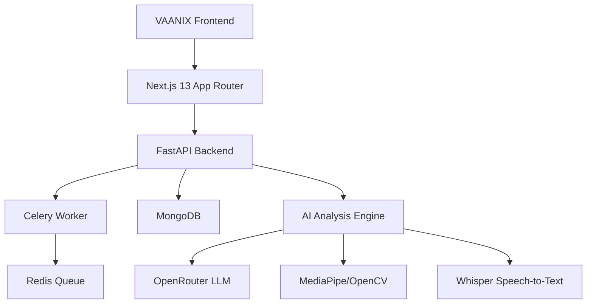

# VAANIX - AI Speech Training Platform

<p align="center">
  
  
  
  
  
  
  
</p>

<p align="center">
  
</p>

<h1 align="center">VAANIX - AI Speech Training Platform</h1>

<p align="center">
  <strong>Level up your speech with VAANIX — AI-powered analysis of voice, expressions, and content.</strong>
  <br>
  <strong>Earn XP, unlock achievements, and master communication.</strong>
</p>

<p align="center">
  <a href="#-features"><strong>Features</strong></a> •
  <a href="#-quick-start"><strong>Quick Start</strong></a> •
  <a href="#-documentation"><strong>Documentation</strong></a> •
  <a href="#-contributing"><strong>Contributing</strong></a> •
  <a href="#-license"><strong>License</strong></a>
</p>

<p align="center">
  <a href="https://your-deployment-url.com">Live Demo</a> •
  <a href="https://your-docs-url.com">Documentation</a> •
  <a href="https://github.com/yourusername/vaanix/issues">Issues</a> •
  <a href="https://github.com/yourusername/vaanix/discussions">Discussions</a>
</p>

## 🎯 Overview

VAANIX is an advanced AI-powered speech training platform designed to transform how people develop their public speaking and communication skills. By combining cutting-edge artificial intelligence with gamified learning principles, VAANIX provides personalized, data-driven feedback that helps users overcome common speaking challenges and build confidence.

Built with a modern tech stack featuring Next.js, FastAPI, and real-time AI analysis, VAANIX offers both live practice sessions and video analysis capabilities. The platform's unique approach combines technical metrics with human-centered coaching insights to deliver actionable feedback that actually improves performance.

### 🎯 Key Value Propositions

- **Data-Driven Feedback**: Get precise, measurable insights instead of generic advice
- **Real-Time Analysis**: Immediate feedback during live practice sessions
- **Comprehensive Metrics**: 5-dimensional scoring covering all aspects of effective communication
- **Gamified Learning**: Engaging progression system that makes improvement fun
- **Personalized Growth**: Track your progress over time with detailed analytics

### 🎯 Target Audience

- **Professionals** seeking to improve presentation skills
- **Students** preparing for speeches and presentations
- **Public speakers** wanting to refine their craft
- **Job seekers** practicing interview skills
- **Anyone** looking to communicate more effectively

## 🚀 Key Features

### 🎯 Practice Modes

| Feature | Description | Technology |
|---------|-------------|------------|
| **Live Practice Session** | Real-time analysis with webcam and microphone integration | WebRTC, Socket.IO |
| **Video Upload Practice** | Detailed analysis of pre-recorded presentations | FFmpeg, Async Processing |
| **Challenge Mode** | Structured speaking exercises with specific goals | Gamification Engine |
| **Studio Mode** | Professional recording environment with advanced metrics | Real-time Analytics |

### 🤖 Real-time Analysis Engine

Our AI engine provides comprehensive feedback through three core analysis modules:

1. **Facial Expression Analysis**
   - Tracks 468 facial landmarks using MediaPipe
   - Detects micro-expressions and emotional states
   - Measures eye contact frequency and engagement
   - Analyzes smile patterns and facial dynamics

2. **Voice Quality Analysis**
   - Speech rate monitoring (words per minute)
   - Pitch variation detection
   - Volume consistency analysis
   - Filler word identification and counting
   - Whisper-based transcription with timestamping

3. **Content Delivery Analysis**
   - Structure evaluation using LLM processing
   - Clarity and persuasion scoring
   - Language precision metrics
   - Content flow and logical progression

### 📊 Feedback & Scoring System

#### Five-Dimensional Scoring (0-100 each)

| Dimension | Metrics | Weight | Focus Area |
|-----------|---------|--------|------------|
| **Content Clarity** | Structure, logic, coherence | 25% | Information delivery |
| **Delivery Fluency** | Pace, rhythm, filler words | 20% | Speaking mechanics |
| **Body Language** | Gestures, posture, movement | 20% | Non-verbal communication |
| **Engagement Level** | Eye contact, audience connection | 20% | Connection quality |
| **Language Precision** | Word choice, grammar, vocabulary | 15% | Verbal sophistication |

### 🎮 Gamified Progression System

#### Experience Points (XP) Structure
- **Base XP**: 500 points per completed session
- **Performance Bonuses**: Up to +300 XP for high scores
- **Streak Multipliers**: 1.2x to 2.0x for consecutive days
- **Achievement Rewards**: 100-1000 XP for milestones
- **Challenge Completion**: 200-500 XP per challenge

#### Speaker Levels

| Level | XP Range | Title | Benefits |
|-------|----------|-------|----------|
| 1 | 0-1,000 | **Novice Speaker** | Basic feedback, core features |
| 2 | 1,001-2,500 | **Apprentice** | Advanced metrics, challenge access |
| 3 | 2,501-5,000 | **Competent Communicator** | Detailed analytics, comparison tools |
| 4 | 5,001-10,000 | **Proficient Speaker** | Premium features, priority processing |
| 5 | 10,001-20,000 | **Expert Presenter** | Custom coaching, advanced insights |
| 6 | 20,001-50,000 | **Master Communicator** | Elite features, community recognition |
| 7 | 50,001+ | **Grandmaster** | VIP support, beta feature access |

#### Achievement System

| Achievement | Criteria | Reward | Badge |
|-------------|----------|--------|-------|
| **First Steps** | Complete first analysis | 100 XP | 🥇 |
| **Perfect Score** | 100 in any category | 500 XP | 🏆 |
| **Streak Master** | 7-day practice streak | 300 XP | 🔥 |
| **Content Creator** | Upload 10 videos | 250 XP | 🎬 |
| **Social Butterfly** | Engage with 50 community posts | 200 XP | 🦋 |
| **Consistency King** | 30 consecutive days | 1000 XP | 👑 |
| **Perfectionist** | 90+ in all categories | 750 XP | ✨ |

### 👤 User Management

- **Secure Authentication**: JWT-based authentication with refresh tokens
- **Profile Management**: Customizable profiles with progress tracking
- **Practice History**: Comprehensive session history with performance trends
- **Social Features**: Leaderboards, community engagement, and peer feedback
- **Privacy Controls**: Granular privacy settings for all content

## 🏗️ Architecture



## 🛠️ Tech Stack

### Frontend
- **Next.js 13** with App Router
- **TypeScript** for type safety
- **Tailwind CSS** for styling
- **Framer Motion** for animations
- **Shadcn/ui** component library
- **Socket.IO** for real-time communication

### Backend
- **FastAPI** REST API
- **Python 3.9+**
- **Celery** for asynchronous task processing
- **Redis** for task queue and caching
- **MongoDB** for data persistence
- **Pydantic** for data validation

### AI/ML Components
- **OpenRouter API** for LLM processing
- **MediaPipe** for facial landmark detection
- **OpenCV** for computer vision
- **Whisper** for speech transcription
- **FFmpeg** for video processing

## 📋 Prerequisites

- **Python 3.9+**
- **Node.js 18+**
- **Redis Server**
- **MongoDB**
- **FFmpeg**
- **Git**

## 🚀 Quick Start

### 1. Clone the Repository
```bash
git clone https://github.com/yourusername/vaanix.git
cd vaanix
```

### 2. Backend Setup
```bash
cd backend
python -m venv venv
source venv/bin/activate  # On Windows: venv\Scripts\activate
pip install -r requirements.txt
```

### 3. Frontend Setup
```bash
cd ../frontend-next
npm install
```

### 4. Environment Configuration
Create `.env` files in both `backend` and `frontend-next` directories:

**backend/.env:**
```env
# Database
MONGODB_URL=mongodb://localhost:27017/speech_trainer
MONGODB_DB_NAME=speech_trainer

# Redis
REDIS_URL=redis://localhost:6379/0

# Authentication
JWT_SECRET_KEY=your-jwt-secret-key
JWT_ALGORITHM=HS256

# AI Services
OPENROUTER_API_KEY=your-openrouter-api-key
OPENROUTER_BASE_URL=https://openrouter.ai/api/v1
OPENROUTER_MODEL=openrouter/auto

# File Upload
MAX_CONTENT_LENGTH=104857600
UPLOAD_FOLDER=temp_uploads
```

**frontend-next/.env:**
```env
NEXT_PUBLIC_API_URL=http://localhost:8000
NEXT_PUBLIC_WS_URL=ws://localhost:8000
```

### 5. Start Services

**Terminal 1 - Redis:**
```bash
redis-server
```

**Terminal 2 - Celery Worker:**
```bash
cd backend
celery -A app.worker.celery_app worker --loglevel=info
```

**Terminal 3 - Backend:**
```bash
cd backend
python main.py
```

**Terminal 4 - Frontend:**
```bash
cd frontend-next
npm run dev
```

### 6. Access the Application
- **Frontend**: http://localhost:3000
- **Backend API**: http://localhost:8000
- **API Docs**: http://localhost:8000/docs

## 🎮 Usage

1. **Sign Up/Login**: Create an account or log in to your existing account
2. **Choose Practice Mode**: 
   - Live Practice for real-time feedback
   - Upload a video for detailed analysis
3. **Record/Upload**: 
   - For live practice: Enable camera and microphone
   - For video upload: Select your presentation video
4. **Get Analysis**: Receive comprehensive feedback on your performance
5. **Track Progress**: Monitor your XP, levels, and achievements
6. **Improve**: Use insights to enhance your speaking skills

## 📊 API Endpoints

### Authentication
- `POST /api/auth/signup` - User registration
- `POST /api/auth/login` - User login
- `GET /api/auth/profile` - Get user profile

### Practice
- `POST /api/practice/upload` - Upload video for analysis
- `GET /api/practice/history` - Get practice history
- `GET /api/practice/analysis/{task_id}` - Get analysis results

### Challenges
- `GET /api/challenges` - List available challenges
- `POST /api/challenges/{id}/attempt` - Attempt a challenge
- `GET /api/challenges/leaderboard` - Get leaderboard

### User Progress
- `GET /api/user/stats` - Get user statistics
- `GET /api/user/achievements` - Get unlocked achievements
- `GET /api/user/level` - Get current level information

## 🎨 UI/UX Design

The platform features a distinctive **cyberpunk/tech aesthetic** with:
- **Color Palette**: 
  - Primary: Orange/Saffron (#FB923C)
  - Secondary: Teal (#06B6D4)
  - Accent: Cyan-400 (#22D3EE) for VAANIX branding
  - Backgrounds: Dark zinc tones
- **Typography**: Pixel-perfect fonts for digital feel
- **Animations**: Smooth Framer Motion transitions
- **Visual Elements**: Grid patterns, glowing effects, and terminal-inspired designs

## 🏆 Gamification System

### XP System
- Earn XP for completed practice sessions
- Bonus XP for improved performance
- Multipliers for streaks and achievements

### Speaker Levels
1. **Novice** (0-1000 XP)
2. **Apprentice** (1001-2500 XP)
3. **Competent** (2501-5000 XP)
4. **Proficient** (5001-10000 XP)
5. **Expert** (10001-20000 XP)
6. **Master** (20001-50000 XP)
7. **Grandmaster** (50001+ XP)

### Achievements
- **First Analysis**: Complete your first speech analysis
- **Perfect Score**: Achieve 100 in any category
- **Streak Master**: Maintain 7-day practice streak
- **Content Creator**: Upload 10 videos
- **Social Butterfly**: Engage with community features

## 🤝 Contributing

We welcome contributions! Please follow these steps:

1. Fork the repository
2. Create a feature branch (`git checkout -b feature/AmazingFeature`)
3. Commit your changes (`git commit -m 'Add some AmazingFeature'`)
4. Push to the branch (`git push origin feature/AmazingFeature`)
5. Open a Pull Request

### Development Guidelines
- Follow the existing code style
- Write clear, descriptive commit messages
- Add tests for new functionality
- Update documentation as needed
- Ensure all tests pass before submitting PR

## 📄 License

This project is licensed under the MIT License - see the [LICENSE](LICENSE) file for details.

## 🙏 Acknowledgments

- **OpenRouter** for LLM services
- **MediaPipe** for facial analysis
- **OpenCV** for computer vision
- **Whisper** for speech recognition
- **Next.js** and **FastAPI** communities

## 📞 Support

For support, feature requests, or bug reports:
- Open an issue on GitHub
- Contact the development team
- Check our documentation

## 🚧 Roadmap

### Upcoming Features
- [ ] Mobile application
- [ ] Advanced analytics dashboard
- [ ] Community features and forums
- [ ] Integration with video conferencing platforms
- [ ] Multi-language support
- [ ] Advanced challenge system
- [ ] AI-powered personalized coaching

### Future Enhancements
- [ ] Voice cloning for practice
- [ ] Virtual reality presentation practice
- [ ] Integration with professional speaking platforms
- [ ] Advanced progress visualization
- [ ] Team/corporate training features

---

<p align="center">
  <strong>Built with ❤️ for better communication</strong>
  <br/>
  <strong>VAANIX - Command Your Vocal Presence</strong>
</p>